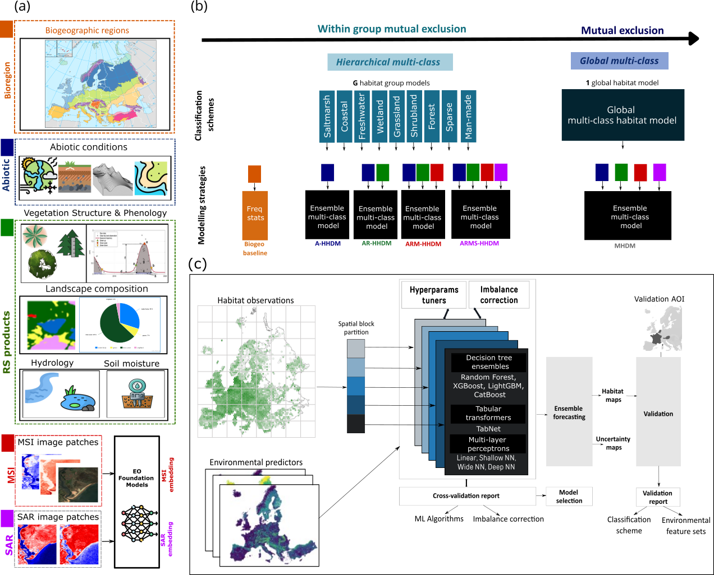

# Continental-scale habitat distribution modelling with multimodal earth observation foundation models

Authors
-------
Sara Si-Moussi, Stephan Hennekens, Sander Mucher, Stan Los, Yoann Cartier, Borja Jiménez-Alfaro, Fabio Attorre, Gianmaria Bonari, Jonathan Lenoir, Jens-Christian Svenning, Wilfried Thuiller

Overview
--------
This repository contains code, model checkpoints, configuration files, and data helpers used in the study "Continental-scale habitat distribution modelling with multimodal earth observation foundation models". The project evaluates and compares multiple foundation models and downstream habitat modelling strategies to predict habitat distributions at continental scales using multimodal Earth observation data.

Fig. 1 — Comparative evaluation (illustrative)




Repository structure
--------------------
- `data_configs/` - JSON and CSV configuration files describing environmental predictors.
- `embedding/` - Scripts to run inference with different foundation models (DOFA, EO4B, Prithvi, SECO, SSL4EO) and notes on multi-GPU inference.
- `foundation_models/` - Checkpoints, model code and requirements for the foundation models used in experiments.
  - `DOFA/`, `EO4B/`, `Prithvi_100M/`, `SSL4ECO/`, `SSL4EO/` - model-specific code, weights, and minimal instructions.
- `model_configs/` - Best-performing downstream model configurations (MLP, TabNet, XGBoost) used in experiments.
- `preparation/` - Data preparation scripts (sentinel extraction, image checks).
- `source/` - Main experimental code: dataset loaders, model definitions, training and evaluation utilities, preprocessing, and loss definitions.
- `training/` - Training scripts, metajob wrappers and example training notes.
- `eunis_legend_detailed.csv` - Legend and label mapping used for habitat categories.


Quick start
-----------
Prerequisites
- Python 3.8+ (conda recommended)
- CUDA-capable GPU (recommended for model inference and training MLP and TabNet)

1) Create and activate a Python environment (example with conda):

```powershell
conda create -n habitat_modelling python=3.9 -y; conda activate habitat_modelling
```

2) Install Python dependencies. This repository now includes a consolidated top-level `requirements.txt`. Some foundation models still include their own `requirements.txt` under `foundation_models/*/` — if you plan to run a specific foundation model, check and install its extras.

Install the consolidated requirements:

```powershell
pip install -r requirements.txt
```

3) Run an embedding/inference script (example):

```powershell
python embedding/run_dofa_inference.py --help
```

4) Train a downstream model (example MLP):

```powershell
python training/train_mlp_habitat_model.py --config model_configs/best_mlp.json
```

Notes
-----
- Foundation model checkpoints are included under `foundation_models/` where licensing permits. Check each model subfolder for licensing and citation information.
- Some scripts expect data paths and environment variables to be set. Inspect the top of each script for configurable paths or modify with command-line arguments where available.

Citation
--------
If you use this repository or data in your work, please cite the associated paper:

Si-Moussi, S., Hennekens, S., Mucher, S., Los, S., & Thuiller, W. (2025). Continental scale habitat modelling with artificial intelligence and multimodal earth observation. arXiv preprint arXiv:2507.09732.

Issues
-------
For questions about the code or data, please create an issue on GitHub.
